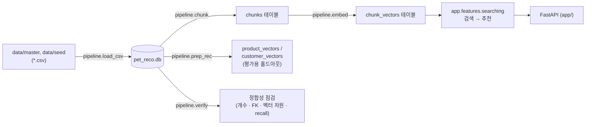

# dev-data-embed

<br/>


<br/>

'오늘 뭐먹냥' — 개·고양이 사료·간식 AI 추천 서비스의 **백엔드**.
더미 데이터 파이프라인(CSV → SQLite → 임베딩)과 그 위에서 도는 FastAPI 서비스(`app/`)를 담습니다.

## 스택

| 영역 | 사용 |
|---|---|
| 웹 서버 | FastAPI, Uvicorn |
| 벡터 검색 | sqlite-vec (SQLite 확장), sentence-transformers (로컬 임베딩) |
| LLM 연동 | LangChain (`langchain-core`/`-openai`/`-anthropic`/`-text-splitters`) — `LLM_PROVIDER`로 스위칭 (`app/core/config.py`). 로컬은 Ollama(`qwen2.5:3b`, OpenAI 호환 엔드포인트), 상용은 Anthropic(답변용 `claude-sonnet-5` / 검증용 `claude-haiku-4-5`를 분리해 자기평가 편향 방지) |
| 토크나이징 | transformers, tiktoken |
| 인증/보안 | pyjwt, bcrypt |
| 평가 (`eval`, 선택 설치) | ragas, langchain-community |
| 트레이싱 (선택 설치) | langsmith |
| 테스트/린트 (`dev`, 선택 설치) | pytest, httpx, ruff |

## 아키텍처

`app/`은 6개 층으로 나뉘고 의존 방향은 한쪽으로만 흐릅니다 (`tests/test_layers.py`가 import 문을 AST로 훑어 이 방향을 강제합니다).

```mermaid
flowchart TB
    api["api (4)<br/>HTTP · 인증 · 상태코드"]
    features["features (3)<br/>추천 · 검색 비즈니스 로직"]
    repo["repositories (2)<br/>SQL 조회"]
    adapters["adapters (2)<br/>LLM · 벡터 스토어"]
    core["core (1)<br/>DB 연결 · 설정 · 인증 · 트레이스"]
    domain["domain (0)<br/>순수 비즈니스 규칙"]

    api --> features
    api --> repo
    api --> domain
    features --> repo
    features --> adapters
    features --> domain
    repo --> core
    adapters --> core
    adapters -. 구현체가 domain.port 를 따름 .-> domain

    repo -. "금지 (SQL만 하는 층)" .-> domain
    repo -. "금지 (SQL만 하는 층)" .-> features
```

데이터는 CSV → SQLite → 임베딩 순으로 오프라인 파이프라인이 만들고, 서비스는 그 결과만 읽습니다.



## 문서

| 파일 | 내용 |
|---|---|
| [`docs/design/GOAL.md`](docs/design/GOAL.md) | 프로젝트 방향·요구사항. 무엇이 필요한지의 기준 |
| [`docs/schema/`](docs/schema/README.md) | **컬럼 레퍼런스** — 테이블별 컬럼·인덱스·설계 노트 |
| [`docs/design/DESIGN.md`](docs/design/DESIGN.md) | DB 스키마 설계 배경 |
| [`docs/DATAINFO.md`](docs/DATAINFO.md) | 더미 CSV 데이터 사전 |
| [`docs/WORK.md`](docs/WORK.md) | 작업일지 |

## 설치

```bash
python -m pip install -e .           # 서버 실행에 필요한 최소 의존성
python -m pip install -e ".[dev]"    # + pytest, httpx, ruff (테스트/린트)
python -m pip install -e ".[eval]"   # + ragas, langchain-community (채점기, python -m eval)
python -m pip install -e ".[trace]"  # + langsmith (LangSmith 트레이싱, 선택)
```

## 실행

스크립트는 상대 경로를 쓰므로 **저장소 루트에서, `-m` 모듈 형태로** 실행합니다. DB가 두 갈래([`AGENTS.md`](AGENTS.md) 참고)로 나뉘니 섞지 마세요.

### Track A — `pet_reco.db` (활성 파이프라인)

```bash
python -m pipeline.make_data.gen_seed   # (선택) data/master + review.csv -> data/seed/*.csv 합성
python -m pipeline.load_csv             # data/master + data/seed -> pet_reco.db 적재
python -m pipeline.chunk                # 리뷰 -> 임베딩용 문서 조립 -> chunks 테이블
python -m pipeline.embed                # chunks -> 벡터 -> chunk_vectors 테이블
python -m pipeline.prep_rec             # 홀드아웃 지정 + product_vectors/customer_vectors 생성 (평가용)
python -m pipeline.verify               # 데이터 개수·FK·벡터 차원·recall 한 번에 점검
python -m eval golden                   # 홀드아웃 리뷰로 recall@1/3/10 · MRR 측정
python -m app.query                     # 프로필+질문 받아 유사 리뷰 찾는 대화형 CLI
uvicorn app.main:app --reload           # FastAPI 서버 기동
```

### Track B — `user.db` (설계 중, 아직 데이터 미적재)

```bash
py pipeline/create_schema/execute_schema.py   # user.db 스키마 생성 (16 테이블 + 2 뷰)
```

`python` 이 아니라 `py` 인 이유: 스키마가 STRICT 테이블을 쓰므로 **SQLite 3.37+** 가 필요합니다.
PATH 의 `python` 이 구버전(3.9 / SQLite 3.35)이면 `malformed database schema` 로 실패합니다.

`user.db`는 생성 결과물입니다. 직접 편집하지 말고 스크립트로 다시 만드세요.

## 스키마 코드 구성

`pipeline/create_schema/` 는 `docs/schema/` 문서 구성과 1:1 로 대응합니다.

| 파일 | 내용 |
|---|---|
| `execute_schema.py` | **진입점.** 아래 모듈에서 DDL 을 모아 순서대로 실행 + 설계 규칙 전문 |
| `common_schema.py` | `animal_category`, `allergen` (두 도메인이 공유하는 코드표) |
| `user_schema.py` | `user` |
| `pet_schema.py` | `breed`, `pet`, `pet_breed`, `pet_allergy` |
| `product_schema.py` | 제품 8테이블 + 뷰 2개 |
| `purchase_schema.py` | `purchase`, `review` |
