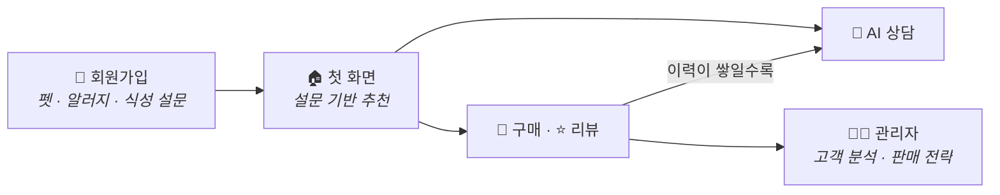
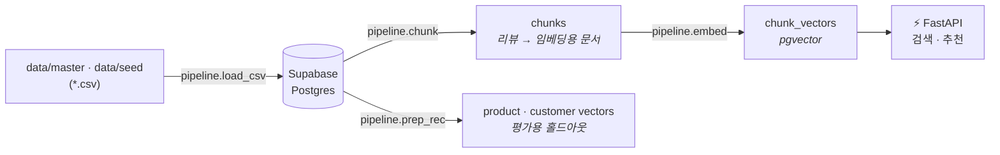
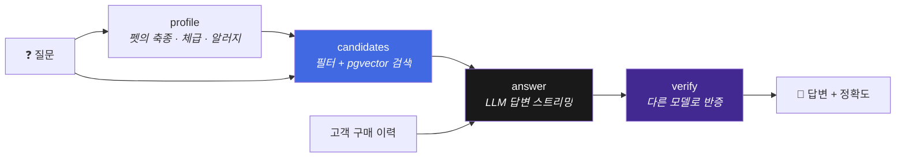
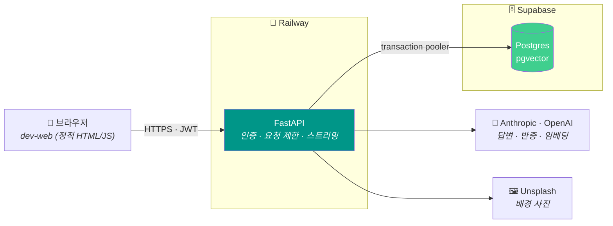
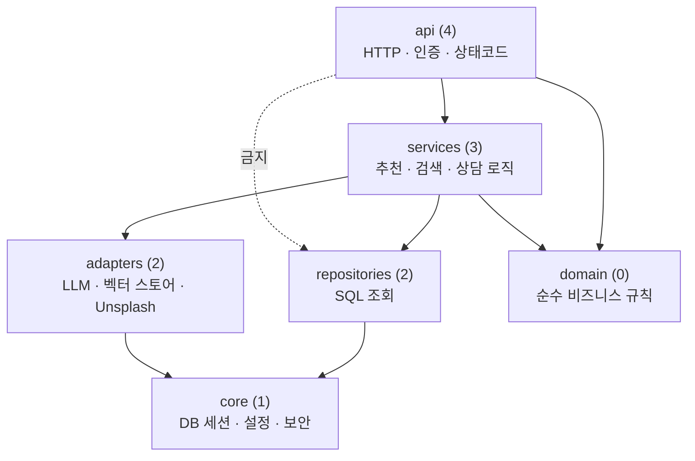

<div align="center">

# 🐶 오늘뭐멍냥 🐱

### 우리 아이 기록이 고르는 오늘의 한 끼

**반려동물의 알러지 · 체급 · 구매 이력을 근거로, AI가 사료 · 간식을 추천하고 질문에 답하는 RAG 서비스의 백엔드**

<br/>


<br/>


<br/>


<br/>

[**소개**](#-소개) · [**주요 기능**](#-주요-기능) · [**동작 흐름**](#-동작-흐름) · [**아키텍처**](#-시스템-아키텍처) · [**기술 스택**](#-기술-스택) · [**배포**](#-배포) · [**실행**](#-로컬-실행)

</div>

---

## 📌 소개

사료 · 간식은 종류가 너무 많고, 알러지가 있는 아이라면 **성분표를 하나하나 확인**해야 합니다.
오늘뭐멍냥은 가입할 때 받은 **펫 정보(축종 · 체급 · 알러지 · 식성 메모)** 와 **실제 구매 · 리뷰 이력**을 근거로
조건에 맞는 상품만 먼저 걸러 낸 뒤, AI가 그 안에서 추천하고 질문에 답합니다.

| 누구를 위한가 | 무엇을 해결하는가 |
|---|---|
| 🐾 반려인 | "우리 아이가 먹어도 되는 사료는?" — 알러지 성분을 뺀 후보 안에서만 추천 |
| 🛍️ 판매자 · 상담원 | 고객의 구매 이력을 근거로 한 판매 전략 · 응대안 |
| 🛠️ 운영자 | 고객 질문 기록 · 상품 관리 · 추천 품질 평가(eval) |

> 프론트엔드(관리자 대시보드 · 고객 페이지)는 별도 저장소 [`dev-web`](https://github.com/TodayWhatDish/dev-web)에 있고, 이 저장소의 API를 직접 호출합니다.

---

## ✨ 주요 기능

<table>
<tr>
<td width="33%" valign="top">

### 🎯 맞춤 추천
펫 프로필로 **알러지 · 축종 · 체급 필터**를 건 벡터 검색 후, LLM이 후보 중에서 고릅니다. 후보 밖 상품을 지어내면 검증에서 걸러 다시 시도합니다.

</td>
<td width="33%" valign="top">

### 💬 AI 상담 (스트리밍)
질문에 맞는 리뷰와 **이 고객의 실제 구매 이력**을 함께 넣어 답하고, 답변을 한 글자씩 흘려보냅니다.

</td>
<td width="33%" valign="top">

### ✅ 답변 반증(팩트체크)
답변을 만든 모델과 **다른 모델**이 고객 정보와 대조해 정확도를 매깁니다 — 자기평가 편향을 피하려는 설계입니다.

</td>
</tr>
<tr>
<td valign="top">

### 📈 고객 분석 · 판매 전략
관리자가 고객을 고르면 구매 이력 · 유사 리뷰 · **판매 전략**을 보여 줍니다. LLM이 인용한 근거 구매는 SQL로 실제 여부를 대조합니다.

</td>
<td valign="top">

### 🐕 회원 · 펫 · 구매
회원가입과 펫 등록(알러지 · 식성 설문 포함)을 **한 트랜잭션**으로 처리하고, 구매 · 리뷰를 기록합니다.

</td>
<td valign="top">

### 🧪 품질 평가
홀드아웃 리뷰로 **recall@k · MRR**, RAGAS · 형식 검사까지 `python -m eval` 한 줄로 채점합니다.

</td>
</tr>
</table>

---

## 🔄 동작 흐름

### 사용자 여정



### 데이터는 이렇게 쌓입니다

CSV에서 시작해 임베딩까지 **오프라인 파이프라인**이 만들고, 서버는 그 결과를 읽기만 합니다.



| 단계 | 하는 일 |
|---|---|
| `load_csv` | 테이블을 FK 순서로 자동 정렬해 CSV 적재 (스키마 원천은 `app/models/`) |
| `chunk` | 리뷰 + 상품 정보를 문서로 조립하고 토큰 한도로 자르기 |
| `embed` | 문서를 벡터로 바꿔 pgvector에 저장 |
| `verify` | 개수 · FK · 벡터 차원 · recall · 샘플 질의를 한 번에 점검 |

### AI 질문 하나가 답이 되기까지



응답은 NDJSON 스트림으로 `customer_facts → sources → delta… → verification → done` 순서로 흘러갑니다.
근거(고객 정보 · 참고 리뷰)를 답변보다 **먼저** 보내 화면에서 눈으로 대조할 수 있게 했습니다.

---

## 🏗️ 시스템 아키텍처



### 계층 구조

`app/`은 6개 층으로 나뉘고, 의존은 **한 방향으로만** 흐릅니다. `tests/test_layers.py`가 import 문을 AST로 훑어 이 규칙을 강제합니다.



**설계 포인트**
- 🧾 **LLM을 그대로 믿지 않기** — 추천은 후보 밖 상품을 걸러 재시도하고, 판매 전략의 근거 구매는 SQL로 대조하며, 상담 답변은 다른 모델이 반증합니다.
- 🔁 **요청 단위 DB 세션** — 요청마다 세션을 열고 끝나면 닫습니다(스트리밍 응답 포함). 회원가입처럼 여러 테이블에 쓰는 작업은 트랜잭션 하나로 묶습니다.
- 🛡️ **민감 정보는 서버 안에** — LLM 오류 원문은 로그에만 남기고 클라이언트엔 고정 문구만 보냅니다. 로그인 · AI 경로는 IP별 요청 제한을 둡니다.
- 🔀 **모델은 설정으로 교체** — 임베딩 모델은 `EMBED_PROFILES` 표 하나, LLM은 `.env`의 `LLM_PROVIDER` · `API_MODEL` 값만 바꾸면 됩니다.

---

## 🧰 기술 스택

| 영역 | 기술 |
|---|---|
| **API Server** | Python 3.12 · FastAPI · Uvicorn · Pydantic Settings |
| **Database** | Supabase Postgres · pgvector · SQLAlchemy 2.0 · psycopg 3 |
| **LLM · RAG** | LangChain · Anthropic (답변) · OpenAI (임베딩 `text-embedding-3-small`, 반증) · tiktoken |
| **Local (선택)** | sentence-transformers · Ollama — 로컬 임베딩 · 로컬 LLM 실험용 |
| **Auth** | JWT (PyJWT) · bcrypt |
| **Evaluation** | RAGAS · 자체 골든셋 (recall@k · MRR) · LangSmith (선택) |
| **Infra** | Railway (Docker) · Supabase |
| **Quality** | pytest (계층 규칙 + 자체검증 스크립트) · Ruff |

---

## 🚀 배포

| 대상 | 플랫폼 | 방식 |
|---|---|---|
| API 서버 | Railway | 루트 `Dockerfile`로 빌드, 헬스체크 `/health` |
| DB | Supabase | transaction pooler 경유, 스키마 원천은 `app/models/` |
| 프론트엔드 | — | 별도 저장소 [`dev-web`](https://github.com/TodayWhatDish/dev-web) |

배포 이미지에는 torch · sentence-transformers를 넣지 않습니다. 서버는 OpenAI 임베딩 API로 돌고, 로컬 임베딩은 `.[local]` 선택 설치입니다.

---

## 📁 프로젝트 구조

```
dev-data-embed/
├── app/                       # FastAPI 서버
│   ├── api/                     HTTP — 라우트 · 인증/요청 제한(deps) · 에러 매핑 · lifespan
│   ├── services/                업무 로직 — 추천 · 검색 · 상담 · 판매 전략 · 회원
│   ├── repositories/            SQL 조회만
│   ├── adapters/                외부 서비스 — LLM · 벡터 스토어 · Unsplash
│   ├── domain/                  순수 규칙 — 알러지 판정 · 마스킹 · 프롬프트
│   ├── core/                    DB 세션 · 설정 · 보안 · 임베더
│   └── models/                  SQLAlchemy 모델 (스키마 단일 원천)
│
├── pipeline/                  # 오프라인 데이터 파이프라인 (CSV → DB → 임베딩)
├── eval/                      # 추천 · 답변 품질 채점기
├── tests/                     # 계층 규칙 테스트 + 자체검증 스크립트
├── data/                      # master · seed CSV
└── docs/                      # 설계 · 스키마 · 리팩터링 체크리스트
```

---

## 💻 로컬 실행

**요구 사항:** Python 3.12 · Supabase 프로젝트 · LLM API 키 (`.env`에 설정)

```bash
python -m pip install -e ".[dev]"    # 서버 + pytest · httpx · ruff
# 선택: ".[local]" 로컬 임베딩 · ".[eval]" 채점기 · ".[trace]" LangSmith

uvicorn app.main:app --reload        # http://localhost:8000/docs
```

스크립트는 상대 경로를 쓰므로 **저장소 루트에서, `-m` 모듈 형태로** 실행합니다.

```bash
python -m pipeline.make_data.gen_seed   # (선택) data/master + review.csv -> data/seed/*.csv 합성
python -m pipeline.load_csv             # CSV -> Supabase 적재
python -m pipeline.chunk                # 리뷰 -> 임베딩용 문서 -> chunks
python -m pipeline.embed                # chunks -> 벡터 -> chunk_vectors
python -m pipeline.prep_rec             # 홀드아웃 지정 + 평가용 벡터 생성
python -m pipeline.verify               # 개수 · FK · 벡터 차원 · recall 점검

pytest                                  # 계층 규칙 + 빠른 자체검증
python -m eval all                      # 채점기 전부 (요금 드는 것 제외, --with-llm 으로 포함)
```

> `pipeline/create_schema/`는 SQLite `user.db` 설계 문서(`docs/schema/`와 1:1)입니다. 실제 서버 스키마는 `app/models/`가 원천입니다.

---

## 📚 더 보기

| 문서 | 내용 |
|---|---|
| [docs/design/GOAL.md](./docs/design/GOAL.md) | 프로젝트 방향 · 요구사항 |
| [docs/design/DESIGN.md](./docs/design/DESIGN.md) | DB 스키마 설계 배경 |
| [docs/schema/](./docs/schema/README.md) | 테이블별 컬럼 · 인덱스 레퍼런스 |
| [docs/DATAINFO.md](./docs/DATAINFO.md) | 더미 CSV 데이터 사전 |
| [docs/REFACTOR.md](./docs/REFACTOR.md) | 리팩터링 체크리스트 (P0 ~ P3) |
| [AGENTS.md](./AGENTS.md) | 개발 규칙 |
