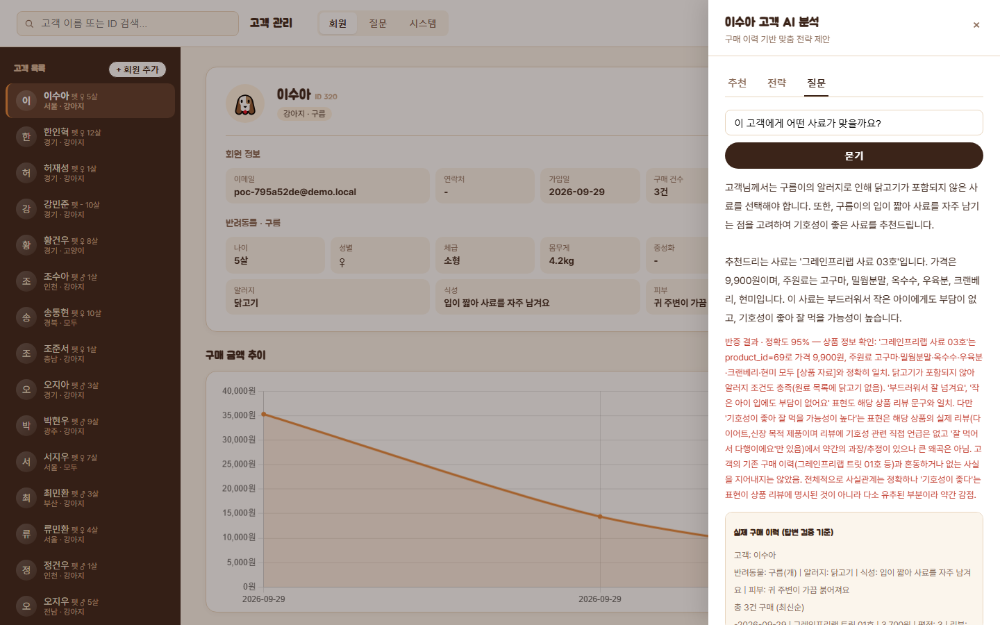
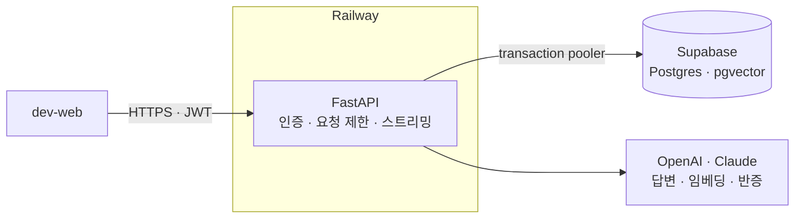
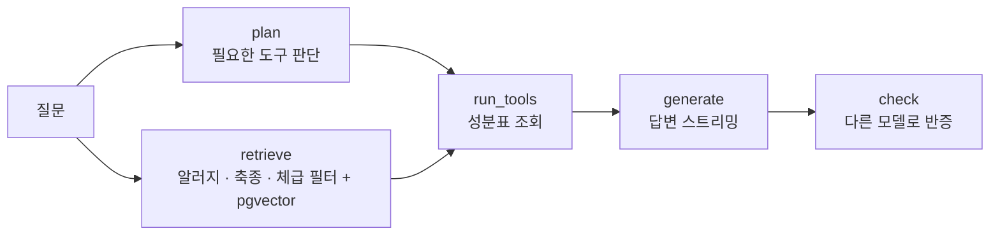

<div align="center">

# 오늘뭐멍냥 — Backend

펫 정보와 구매 · 리뷰 이력을 근거로 상품을 추천하고 질문에 답하는<br/>
RAG 서비스의 API 서버 · 데이터 파이프라인




<sub>관리자 AI 분석 패널 — 답변 아래 빨간 글씨가 다른 모델의 반증 결과(정확도 · 근거)입니다.</sub>

**[📊 성능 비교 리포트 → 토큰 −90% · recall@3 12.7→25.8% · 이미지 −77%](./docs/PERFORMANCE.md)**

</div>

<br/>

## 소개

알러지가 있는 아이의 보호자는 사료 성분표를 하나하나 확인해야 합니다.
이 서버는 가입 때 받은 **펫 정보(축종 · 체급 · 알러지 · 식성 메모)** 와 **실제 구매 · 리뷰 이력**으로 조건에 맞는 상품만 먼저 걸러 낸 뒤,
AI가 그 안에서 추천하고 질문에 답합니다. 화면은 [dev-web](https://github.com/TodayWhatDish/dev-web)이 이 API를 직접 호출합니다.

## 주요 기능

| 기능 | 설명 |
|---|---|
| **맞춤 추천** | 알러지 · 축종 · 체급 필터를 건 벡터 검색 후 LLM이 후보 중에서 선택. 후보 밖 상품은 걸러 재시도 |
| **AI 상담** | LangGraph로 계획 · 검색을 병렬 실행하고, 필요하면 성분표 도구를 불러 유사 리뷰 · 구매 이력과 함께 답변. NDJSON으로 스트리밍 |
| **답변 반증** | 답변 모델과 **다른 모델**이 고객 정보 · 상품 자료 · 성분표와 대조해 정확도 채점 (자기평가 편향 회피) |
| **고객 분석 · 판매 전략** | 구매 이력 · 유사 리뷰 · 판매 전략 제공. LLM이 인용한 근거 구매는 SQL로 대조 |
| **회원 · 펫 · 구매** | 회원가입과 펫 등록을 한 트랜잭션으로 처리하고 구매 · 리뷰 기록 |
| **품질 평가** | `python -m eval all` 한 줄로 검색 품질(recall@k · MRR · hit@5)과 안전 지표(축종 · 알러지 위반) 채점 |

## 아키텍처


```mermaid
flowchart LR
    U[dev-web] -->|HTTPS · JWT| API

    subgraph Railway
        API[FastAPI<br/>인증 · 요청 제한 · 스트리밍]
    end

    API -->|transaction pooler| PG[(Supabase<br/>Postgres · pgvector)]
    API --> LLM[OpenAI · Claude<br/>답변 · 임베딩 · 반증]
```

- **LLM을 그대로 믿지 않습니다.** 추천은 후보 밖 상품을 걸러 재시도하고, 판매 전략의 근거 구매는 SQL로 대조하며, 상담 답변은 다른 모델이 반증합니다.
- **민감 정보는 서버 안에 둡니다.** LLM 오류 원문은 로그에만 남기고, 로그인 · AI 경로는 IP별 요청 제한을 둡니다.
- **의존은 한 방향입니다.** `api → services → repositories · adapters → core`, 규칙은 `domain`에 모았고 `tests/test_layers.py`가 import를 검사해 강제합니다.
- **모델은 설정으로 교체합니다.** 임베딩은 `EMBED_PROFILES` 표 하나, LLM은 `.env`의 `LLM_PROVIDER` · `API_MODEL`, 반증 모델은 `VERIFY_PROVIDER` · `VERIFY_MODEL`만 바꿉니다. 지금 배포는 답변 OpenAI, 반증 Claude입니다.

### 질문 하나가 답이 되기까지

`/ask` · `/ask/me`는 LangGraph 그래프(`app/graph/`)로 돌아갑니다. 근거(고객 정보 · 참고 리뷰)를 답변보다 먼저 보내 화면에서 대조할 수 있게 했습니다.


```mermaid
flowchart LR
    Q[질문] --> PL[plan<br/>필요한 도구 판단]
    Q --> R[retrieve<br/>알러지 · 축종 · 체급 필터 + pgvector]
    PL --> T[run_tools<br/>성분표 조회]
    R --> T
    T --> G[generate<br/>답변 스트리밍]
    G --> C[check<br/>다른 모델로 반증]
```

응답 스트림 순서: `customer_facts → sources → tool_result → delta… → verification → done`

알러지 필터는 리뷰가 아니라 **상품 원료** 기준입니다 — 원료 → 알레르겐 매핑에 해당 알레르겐이 하나라도 있으면 `NOT EXISTS`로 후보에서 뺍니다.

### 데이터 파이프라인

CSV에서 임베딩까지 오프라인으로 만들고, 서버는 결과를 읽기만 합니다.

| 단계 | 내용 |
|---|---|
| `load_csv` | 테이블을 FK 순서로 정렬해 CSV 적재 (스키마 원천은 `app/models/`) |
| `chunk` | 리뷰 + 상품 정보를 문서로 조립하고 토큰 한도로 자르기 |
| `embed` | 문서를 벡터로 바꿔 pgvector에 저장 |
| `prep_rec` | 평가용 홀드아웃 지정 · 상품 / 고객 벡터 생성 |
| `verify` | 개수 · FK · 벡터 차원 · recall · 샘플 질의 점검 |

## 기술 스택

| 영역 | 사용 기술 |
|---|---|
| API Server | Python 3.12, FastAPI, Uvicorn, Pydantic v2 |
| Auth | PyJWT, bcrypt |
| Database | Supabase Postgres, pgvector, SQLAlchemy 2.0, Alembic |
| LLM · RAG | LangChain, LangGraph, OpenAI (답변 · 임베딩), Claude (반증), NumPy, tiktoken |
| Evaluation | 골든셋 recall@k · MRR, 안전 지표(축종 · 알러지 위반) |
| Infra | Railway (Docker), Supabase |
| Quality | pytest, Ruff |

## 프로젝트 구조

```
app/
  api/            HTTP — 라우트 · 인증 · 요청 제한 · 에러 매핑
  graph/          AI 상담 LangGraph — plan · retrieve · run_tools · generate · check
  services/       추천 · 검색 · 상담 · 판매 전략 · 회원
  repositories/   SQL 조회
  adapters/       LLM · 벡터 스토어
  domain/         알러지 판정 · 마스킹 · 프롬프트
  core/           DB 세션 · 설정 · 보안 · 임베더
  models/         SQLAlchemy 모델 (스키마 원천)
pipeline/         CSV → DB → 임베딩
eval/             추천 · 답변 품질 채점기
tests/            계층 규칙 + 자체검증
data/             master · seed CSV (더미 데이터)
```

## 로컬 실행

Python 3.12, Supabase 프로젝트, LLM API 키(`.env`)가 필요합니다. 명령은 저장소 루트에서 `-m` 모듈 형태로 실행합니다.

```bash
python -m pip install -e ".[dev]"   # 선택: .[local] 로컬 임베딩 · .[eval] 채점기
uvicorn app.main:app --reload       # http://localhost:8000/docs

# 데이터 적재
python -m pipeline.load_csv
python -m pipeline.chunk
python -m pipeline.embed
python -m pipeline.prep_rec
python -m pipeline.verify

# 검사
pytest
python -m eval all                  # --with-llm 으로 요금 드는 채점 포함
```

배포는 루트 `Dockerfile`로 Railway에서 빌드하며, 헬스체크는 `/health`입니다.

## 더 보기

- [성능 비교 리포트](./docs/PERFORMANCE.md) — 토큰 절감 · 검색 품질 · 임베딩 모델 선정 · 응답 속도 실측
- [개발 규칙](./AGENTS.md) — 명령어 · 코드 스타일 · 계층 규칙
- [설계 배경](./docs/design/GOAL.md) — 프로젝트 방향 · 요구사항, [DB 설계](./docs/design/DESIGN.md)
- [스키마 레퍼런스](./docs/schema/README.md) — 테이블별 컬럼 · 인덱스
- [데이터 사전](./docs/DATAINFO.md) — 더미 CSV 설명
- [리팩터링 체크리스트](./docs/REFACTOR.md)

Apache-2.0
