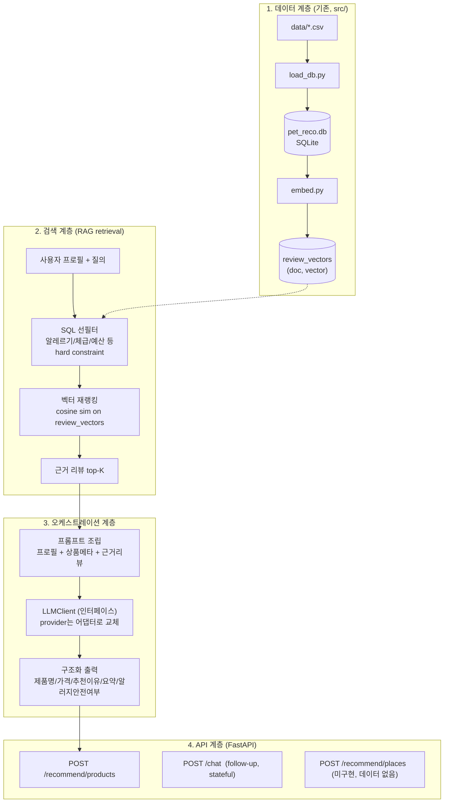

# 아키텍처 설계 — 데이터 + RAG + LLM 서비스 계층

범위: 프로필 기반 상품/명소 추천을 만드는 데이터→검색→LLM 파이프라인.
프론트엔드·결제·인증은 GOAL.md의 개념만 인지하고 상세 설계에서 제외.
LLM 제공자·배포 형태는 미정이라, 교체 가능한 인터페이스로 감싼다.

## 1. 레이어 구조



## 2. 이미 검증된 핵심 원칙

1. **hard constraint는 SQL, soft preference는 벡터.**
   `src/embed.py`의 `search()`에서 이미 확인된 사실: 벡터 유사도만으로는 "닭고기 알레르기 소형견" 같은 조건이 지켜지지 않는다(상위 결과가 대형견 리뷰였음, `docu/WORK.md` §3). 알레르기처럼 틀리면 안 되는 조건은 반드시 SQL 선필터를 거친 뒤에만 벡터 랭킹을 적용한다. 검색 계층은 이 순서를 강제하는 것 자체가 존재 이유다.

2. **LLM은 검색된 근거 밖의 내용을 말하지 않는다.**
   GOAL.md의 차별점("추측하지 않고 근거를 찾는다")을 지키려면, 프롬프트에 근거 리뷰를 구조화해서 넣고 "이 리뷰들 안에서만 근거를 들어 답하라"고 강제해야 한다. 근거 리뷰 자체가 모순되면(아래 3번) LLM도 모순된 답을 낸다 — 프롬프트 설계로 못 막는 문제라 데이터 품질이 선행 조건이다.

3. **LLMClient는 인터페이스로 감싼다.**
   provider가 미정이므로 오케스트레이션 계층은 `generate(prompt, schema) -> dict` 하나만 알면 되게 만든다. Claude/OpenAI 어느 쪽으로 정해지든 어댑터 하나만 갈아끼운다. provider 결정 전까지는 mock 구현체로 API 계층까지 먼저 이어서 end-to-end를 검증할 수 있다.

## 3. 데이터 계층 — 추가로 필요한 것

- **`pet_places` 테이블** — 아직 없음(GOAL.md 요구사항, `docu/WORK.md` 남은 과제). 위치/동반가능여부/견종크기/장소유형/편의시설. 리뷰 기반이 아니라 장소 설명 기반 RAG라 검색 계층의 "근거 리뷰"를 "근거 장소 설명"으로 바꿔야 함 — 검색 계층 재사용 가능, 데이터만 새로 필요.
- **`affiliate_links` 테이블** — `product_id → 쿠팡 파트너스 URL(더미)`. 메인 수익 구조(GOAL.md)가 여기 걸려 있어서, API 응답의 최종 필드로 항상 붙어야 함.

## 4. 알려진 리스크 (설계에 이미 반영해야 하는 것)

`docu/WORK.md`의 "남은 과제"가 그대로 이 파이프라인의 리스크다:

- **더미데이터 정합성** — 견종/체형 모순 행이 있음. RAG 근거로 쓰면 LLM이 모순된 답을 낸다. → 임베딩 전에 검증 스텝 필요(원칙 2와 직결).
- **토큰 잘림** — 현재 모델 한도 128토큰, 문서 평균 97토큰, 3% 잘림. 리뷰가 길어질수록 악화, 결론 문장이 잘리는 경우가 많음.
- **벡터 저장 포맷** — JSON 문자열이라 8.3MB(원래 1.5MB면 될 양). 지금 규모는 무관하나 먼저 손볼 지점으로 기록.

## 5. API 초안

```
POST /recommend/products
  in:  { profile: {...}, query: str }
  out: { recommendations: [{ product, reason, evidence_reviews, safety, affiliate_url }] }

POST /chat
  in:  { session_id, message }
  out: { reply, evidence_reviews }
  # 프리미엄 기능. 이전 턴의 검색 결과를 재사용할지 매 턴 재검색할지는 세션 설계 시 결정

POST /recommend/places   # 미구현 — pet_places 데이터 없음
```

## 6. 다음 단계 (제안 순서)

1. `LLMClient` 인터페이스 + mock 구현체 → `/recommend/products` 하나를 end-to-end로 통과시킨다.
2. 더미데이터 정합성 검증 스크립트를 임베딩 파이프라인 앞에 추가(원칙 2 때문에 선행 필요).
3. provider 결정되면 어댑터 추가, `pet_places` 데이터 생성 후 검색 계층 재사용해 `/recommend/places` 붙인다.
